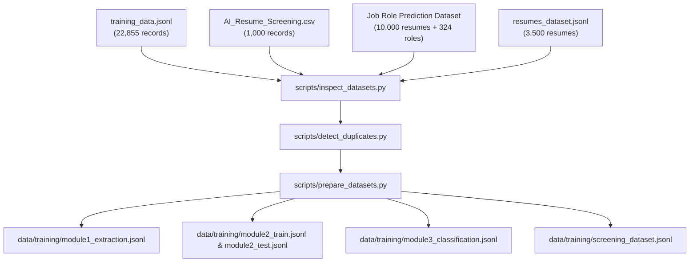

# Multi-Dataset Pipeline & Data Engineering Guide

## 1. Pipeline Architecture



---

## 2. Command Reference

```powershell
# 1. Inspect all 4 datasets
python scripts/inspect_datasets.py

# 2. Cross-dataset duplicate and leakage detection
python scripts/detect_duplicates.py

# 3. Prepare task datasets & candidate-level partitions
python scripts/prepare_datasets.py

# 4. Train Models
python training/train_module2.py
python training/train_module3.py
python training/train_screening.py

# 5. Evaluate Multi-Module Benchmark
python training/evaluate.py

# 6. Run 56 Unit Tests
pytest -v tests/
```
