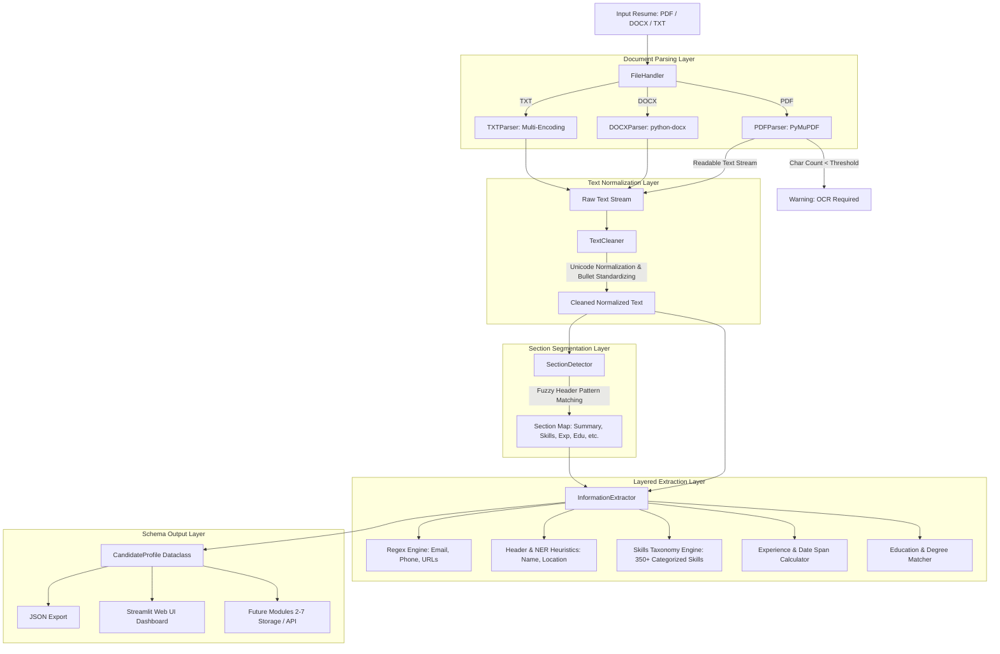

# System Architecture & Technical Design: Module 1 — Resume Information Extraction

**Project:** AI Recruitment Platform  
**Module:** Module 1 of 7 (Resume Information Extraction)  
**Author:** Lead Software & AI/ML Engineer  
**Target Level:** BSc Computer Science Final-Year / Internship Project  

---

## 1. Problem Statement & Objective
Candidate resumes are inherently **unstructured documents**. They are authored in disparate formats (PDF, DOCX, TXT), employ irregular visual layouts (single-column, multi-column, tables, freeform blocks), and utilize inconsistent section naming conventions (e.g. *Experience* vs *Career Story* vs *Where I Worked*).

**Module 1 Objective:** Ingest an unstructured candidate resume file, extract and normalize its text streams, identify structural section boundaries, extract important candidate entities (Personal Contact Details, Categorized Skills, Work Experience, Education, Certifications, Projects, Spoken Languages, and Achievements), and serialize the extracted data into a canonical, standardized **Candidate Profile JSON Schema**.

The output of Module 1 serves as the foundational data contract consumed downstream by **Modules 2–7** (Job Recommendation, Classification, Resume-Job Matching, Skill Gap Analysis, Candidate Ranking, and Candidate Recommendation).

---

## 2. System Architecture



---

## 3. Detailed Component Breakdown

### 3.1 File Handling Layer (`src/resume/file_handler.py`)
- **Purpose:** Inspects uploaded file extensions, checks size constraints (15MB security limit), and routes files to the appropriate parser.
- **Why Needed:** Decouples input formats from text processing logic, allowing additional formats (e.g., HTML, RTF) to be plugged in seamlessly in the future.

### 3.2 Document Parsers
- **`src/resume/pdf_parser.py` (PyMuPDF / fitz):**
  - High-performance, low-memory PDF parser.
  - Extracts text page-by-page.
  - **Scanned PDF Detection:** If the document has pages but total extracted non-whitespace text is $< 30$ characters, it flags the file as `warning_ocr_required` rather than producing false empty candidate profiles.
- **`src/resume/docx_parser.py` (python-docx):**
  - Parses Word XML documents.
  - Ingests both standard paragraphs and multi-column tabular data (where candidates frequently format skills and employment timelines).
- **`src/resume/txt_parser.py`:**
  - Multi-encoding fallback sequence: `utf-8` $\to$ `utf-8-sig` (BOM) $\to$ `latin-1` $\to$ `cp1252` $\to$ `iso-8859-1`.

### 3.3 Text Cleaning & Normalization (`src/resume/text_cleaner.py`)
- **Unicode Normalization:** Applies NFKC normalization to resolve ligature characters (e.g., `fi`, `fl`).
- **Control Character Stripping:** Removes non-printable ASCII control codes while preserving semantic line breaks (`\n`) and tabs.
- **Bullet Standardization:** Replaces erratic bullet glyphs (`•`, `●`, `■`, `◆`, `➢`) with standard Markdown dashes (`- `).
- **Broken Hyphen Re-assembly:** Re-joins words severed across line wraps (e.g., `micro-\nservices` $\to$ `microservices`).

### 3.4 Section Boundary Segmentation (`src/resume/section_detector.py`)
- Employs a regex dictionary of standard and creative section headings:
  - `summary`: *Summary, Career Objective, About Me, Profile, Who I Am*
  - `skills`: *Technical Skills, Core Competencies, My Toolkit & Arsenal, Tech Stack*
  - `experience`: *Work Experience, Professional History, Career Story & Journey*
  - `education`: *Education, Academic Background, Where I Studied, Qualifications*
  - `projects`: *Projects, Key Applications, Things I Have Built, Selected Works*
  - `certifications`: *Certifications, Licenses & Accreditations, Courses*
  - `achievements`: *Achievements, Honors & Awards, Accomplishments*
  - `languages`: *Languages Known, Spoken Languages*

### 3.5 Skills Taxonomy Engine (`src/resume/skills_taxonomy.py`)
- Maps 350+ industry-standard skills across **8 distinct categories**:
  1. `programming_languages` (Python, Java, C++, C#, TypeScript, Go, Rust, etc.)
  2. `frameworks` (React, Next.js, Django, FastAPI, Spring Boot, etc.)
  3. `libraries` (PyTorch, TensorFlow, Pandas, NumPy, scikit-learn, spaCy, etc.)
  4. `databases` (PostgreSQL, MySQL, MongoDB, Redis, Cassandra, etc.)
  5. `cloud` (AWS, Microsoft Azure, Google Cloud Platform, etc.)
  6. `tools` (Docker, Kubernetes, Jenkins, Terraform, Git, etc.)
  7. `technical` (Machine Learning, DevOps, RESTful APIs, System Design, etc.)
  8. `soft_skills` (Leadership, Communication, Problem Solving, Agile, etc.)
- Preserves exact casing and symbols (e.g., `C` vs `C++`, `C#`, `.NET`, `Node.js`, `CI/CD`).

### 3.6 Information Extractor (`src/resume/information_extractor.py`)
- **Contact Details:** RFC-5322 regex for email, international standard telephone regex, and URL pattern matchers for LinkedIn, GitHub, and portfolios.
- **Candidate Name:** Analyzes the top 4 lines of the resume header using token filtering, blacklist verification, and optional spaCy Named Entity Recognition (`PERSON` tag).
- **Work Experience & Duration:** Detects standard job titles, company affiliations, and date ranges (e.g. `Jan 2021 – Present`). Computes fractional duration in years and aggregates `total_years`.
- **Education:** Extracts academic degrees (`B.S.`, `B.Tech`, `M.S.`, `Ph.D.`), fields of study, university names, graduation years, and GPA / honours.

---

## 4. Master Data Schema

The canonical schema output is defined in `src/resume/profile_schema.py` and exported as JSON:

```json
{
  "personal_info": {
    "name": "Alex Rivera",
    "email": "alex.rivera@email.com",
    "phone": "+1 (555) 234-5678",
    "location": "San Francisco, CA",
    "linkedin": "https://linkedin.com/in/alexrivera-cs",
    "github": "https://github.com/alexrivera-dev",
    "portfolio": "https://alexrivera.dev"
  },
  "summary": "Motivated Computer Science graduate with a strong foundation in data structures...",
  "experience": {
    "total_years": 0.5,
    "current_role": "Software Engineer Intern",
    "previous_roles": [],
    "companies": ["Nexus Tech Labs"],
    "details": [
      {
        "title": "Software Engineer Intern",
        "company": "Nexus Tech Labs",
        "duration": "Jun 2023 - Aug 2023 (0.2 yrs)",
        "start_date": "Jun 2023",
        "end_date": "Aug 2023",
        "responsibilities": [
          "Designed and implemented RESTful APIs using Python FastAPI and PostgreSQL..."
        ],
        "technologies": ["FastAPI", "Python", "PostgreSQL", "Docker"]
      }
    ]
  },
  "education": [
    {
      "degree": "B.S.",
      "field_of_study": "Computer Science",
      "institution": "University of California Berkeley",
      "graduation_year": "2020",
      "grade": "GPA: 3.85 / 4.0"
    }
  ],
  "skills": {
    "technical": ["RESTful APIs", "Data Structures & Algorithms"],
    "programming_languages": ["C++", "Java", "Python", "SQL", "TypeScript"],
    "frameworks": ["Django", "Express.js", "FastAPI", "Flask", "React"],
    "libraries": [],
    "databases": ["MongoDB", "PostgreSQL", "Redis", "SQLite"],
    "tools": ["CI/CD", "Docker", "Git", "Postman"],
    "cloud": ["AWS EC2", "AWS S3"],
    "soft_skills": []
  },
  "certifications": [
    {
      "name": "AWS Certified Cloud Practitioner - Amazon Web Services (2023)",
      "issuer": "AWS",
      "date": "2023"
    }
  ],
  "projects": [
    {
      "name": "DevConnect - Developer Community Platform",
      "description": "Built a full-stack discussion forum with real-time notifications...",
      "technologies": ["React", "Redis", "Node.js"],
      "url": "https://github.com/alexrivera-dev/devconnect"
    }
  ],
  "languages": ["English", "Spanish"],
  "achievements": [],
  "metadata": {
    "file_name": "01_fresher_software_engineer.pdf",
    "file_type": "pdf",
    "character_count": 1420,
    "extraction_timestamp": "2026-08-21T18:30:00.000000",
    "status": "success",
    "status_message": "Extraction completed successfully.",
    "confidence": {
      "personal_info.name": "extracted",
      "personal_info.email": "extracted",
      "personal_info.phone": "extracted",
      "personal_info.location": "extracted",
      "personal_info.linkedin": "extracted",
      "personal_info.github": "extracted",
      "summary": "extracted",
      "experience": "extracted",
      "education": "extracted",
      "skills": "extracted",
      "certifications": "extracted",
      "projects": "extracted",
      "languages": "extracted",
      "achievements": "not_found"
    }
  }
}
```

---

## 5. Confidence Tracking Philosophy
Rather than generating arbitrary percentage scores (e.g. *94.7% confidence*), the system employs **deterministic 3-state tracking**:
- **`extracted`**: The entity was verified through strict deterministic pattern validation (e.g. regex with valid top-level domain for emails, known degree keyword match, or skills confirmed inside an explicit *Skills* section).
- **`uncertain`**: The entity was inferred via positional heuristics (e.g. name picked from the top line without NER, or skills inferred from general body text without a dedicated skills header).
- **`not_found`**: The section or field is completely absent from the resume.

---

## 6. Viva & Presentation Preparation Guide

### Q1: Why did you choose PyMuPDF over other PDF libraries like PyPDF2 or PDFMiner?
> **Answer:** PyMuPDF (`fitz`) is significantly faster (written in C) and extracts layout-aware text streams cleanly without garbling whitespace. It also enables direct page inspection and character density calculation, which is critical for detecting image-only / scanned PDFs.

### Q2: Why use a layered regex + NLP approach instead of sending the resume to an LLM API (e.g. OpenAI / Gemini)?
> **Answer:** 
> 1. **Privacy & Security:** Candidate resumes contain Personally Identifiable Information (PII). A local parser ensures zero data leaves the organization's infrastructure.
> 2. **Deterministic & Cost-Free:** Regex and dictionary matching execute in under 100 milliseconds with zero API costs and no rate limits.
> 3. **Explainability:** In a BSc Computer Science examination, rule-based pipelines provide 100% transparent and explainable logic for every extracted field.

### Q3: How do you handle non-standard resume section headings?
> **Answer:** Through `SectionDetector.is_candidate_header()`, which uses regex pattern arrays covering semantic synonyms (e.g. `MY TOOLKIT & ARSENAL` mapped to `skills`, `WHERE I STUDIED` mapped to `education`, `CAREER STORY` mapped to `experience`).

### Q4: How does Module 1 connect to future Modules 2–7?
> **Answer:** Module 1 exports the standardized `CandidateProfile` dataclass / JSON object.
> - **Module 2 (Job Role Recommendation)** consumes `skills` and `experience.total_years`.
> - **Module 3 (Resume Classification)** consumes `summary`, `skills`, and `experience.details`.
> - **Module 4 (Resume-Job Matching)** matches `skills` and `education` against Job Descriptions.
> - **Module 5 (Skill Gap Analysis)** compares extracted skills against required job skillsets.
> - **Modules 6 & 7 (Ranking & Recommendation)** rank candidates based on experience duration, skill alignment, and education credentials.
