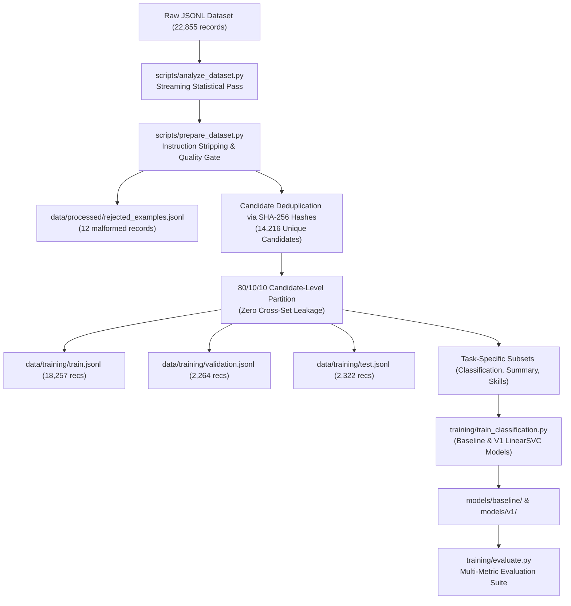

# Data Preparation & Training Pipeline Documentation

## 1. End-to-End Architecture Flow



---

## 2. Pipeline Execution Commands

The complete pipeline can be run from the command line:

### Step 1: Statistical Dataset Analysis
```bash
python scripts/analyze_dataset.py
```
*Outputs*: `reports/dataset_analysis.json` and `reports/dataset_analysis.md`.

### Step 2: Quality Filtering & Candidate-Level Partitioning
```bash
python scripts/prepare_dataset.py
```
*Outputs*: `data/processed/resume_examples.jsonl`, `data/processed/quality_report.json`, and partitioned splits in `data/training/`.

### Step 3: Train Machine Learning Classification Models
```bash
# Train baseline Logistic Regression
python training/train_classification.py --version baseline

# Train V1 Calibrated LinearSVC (Recommended)
python training/train_classification.py --version v1
```
*Outputs*: Saved model artifacts in `models/baseline/` and `models/v1/`.

### Step 4: Build Domain Recommender Engine
```bash
python training/train_resume_model.py
```
*Outputs*: Vector recommender artifacts in `models/recommender/`.

### Step 5: Comprehensive Evaluation & Gold Benchmarking
```bash
python training/evaluate.py
```
*Outputs*: `reports/model_comparison.json`.

---

## 3. Strict Anti-Leakage Candidate Partitioning

In resume conversational datasets, multiple user interactions frequently reference the same candidate's resume (e.g. one conversation requests a summary, another requests skill identification, and another asks for critique). 

If splitting was performed randomly at the record level, the identical resume text would exist in both the training set and the test set, creating **severe data leakage and inflated evaluation scores**.

To eliminate this:
1. The normalized text body of each resume is hashed (`cand_xxxx`).
2. Splitting is executed strictly on the set of unique `candidate_id`s:
   - **80% Candidates $\to$ Training**
   - **10% Candidates $\to$ Validation**
   - **10% Candidates $\to$ Test**
3. Verified Overlap: `Train ∩ Val = 0`, `Train ∩ Test = 0`, `Val ∩ Test = 0`.
